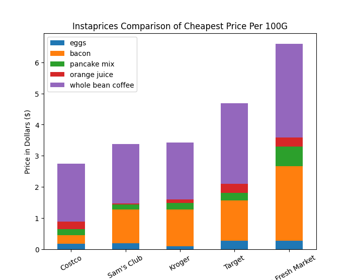

# Instaprices

Instaprices analyzes prices at Instacart stores in your area based on a custom shopping list, compares them, and displays the resulting data in a chart. This is done using Selenium to automate browser behavior and scrape data, and matplotlib to render visuals. Can also import shopping lists from text files, and import/export scraped data as json files. Completed as part of Code Louisville's 2022 Data Analysis 1 course.

## Requirements
- **Python 3.10.2** (older 3.3+ versions may work, but no promises)
- most recent version of **Google Chrome** (older versions may work, but no promises)

## Setup
- Run `git clone https://github.com/richard-oden/instaprices.git` to clone the repository.
- In the instaprices directory, run `python3 -m venv venv` to create the virtual environment.
- Activate the newly created virtual environment. From the instaprices directory run the following command:
    - if using Windows PowerShell: `venv\Scripts\Activate.ps1`
    - if using Linux or Mac with bash/zsh: `venv/bin/activate`
    - (if you're still having trouble, see [this](https://docs.python.org/3/library/venv.html) and [this](https://itnext.io/a-quick-guide-on-how-to-setup-a-python-virtual-environment-windows-linux-mac-bf662c2c77d3) for help.)
- Run `pip install -r requirements.txt` to install the required packages.

## Instructions
- From the instaprices directory, run `python src\main.py` on Windows, or `python src/main.py` on Linux/Mac, then follow the terminal prompts.

## Notes
- Selenium may take **10 minutes or more** to collect data, depending on connection speed, network traffic, and shopping list length, among other factors. If you are short on time and only wish to see the data analysis portion of this project, I recommend simply importing one of the included JSON files.
- The scraping portion of this project will sometimes fail due to unexpected changes to Instacart's site. If this happens repeatedly, it may be best to import one of the included JSON files instead.
- Occasionally the Chrome instance launched by Selenium may get stuck with `data:,` in the address bar. If this happens, try ending any webdriver processes that are already running, then run the program again.

## Project Requirements Met
- Category 1: Python Programming Basics
    - Create a class, then create at least one object of that class and populate it with data.
        - See the models directory for class definitions. For examples of class instantiation, see line 102 in `menu_helper.py`, line 160 in `instaprices_helper.py`, and line 30 in `io_helper.py` among others.
    - Create a dictionary or list, populate it with several values, retrieve at least one value, and use it in your program.
        - Done several times throughout the program, most often on `Store.items.` See `instaprices_helper.get_stores` for an example of this.
    - Create and call at least 3 functions or methods, at least one of which must return a value that is used somewhere else in your code.
        - Done throughout the project. See the `helpers` module for examples.
    - Build a conversion tool that converts user input to another type and displays it.
        - See `instaprices_helper.get_weight_in_grams` on line 84 and `WeighedItem` constructor method.
    - Calculate and display data based on an external factor.
        - Done throughout `selenium_helper` and `instaprices_helper`.
    - Analyze text and display information about it.
        - In `instaprices_helper.py` see `get_stores`, `get_store`, and `get_item` functions.
- Category 2: Utilize External Data
    - Read data from an external file, such as text, JSON, CSV, etc, and use that data in your application.
        - In `io_helper.py`, see `import_file`, `parse_item`, and `deserialize_stores` functions.
- Category 3: Data Display
    - Visualize data in a graph, chart, or other visual representation of data.
        - See `analysis_helper.render_chart`.
- Category 4: Best Practices
    - The program should utilize a virtual environment and document library dependencies in a requirements.txt file.
- "Stretch" Feature List
    - Implement a “scraper” that can be fed a type of file or URL and pull information off of it. For example, a web scraper that lets you provide any website URL and it will find certain keywords on the page.
        - See `selenium_helper.py`.
    - Use pandas, matplotlib, and/or numpy to perform a data analysis project. Ingest 2 or more pieces of data, analyze that data in some manner, and display a new result to a graph, chart, or other display.
        - See `analysis_helper.py`.